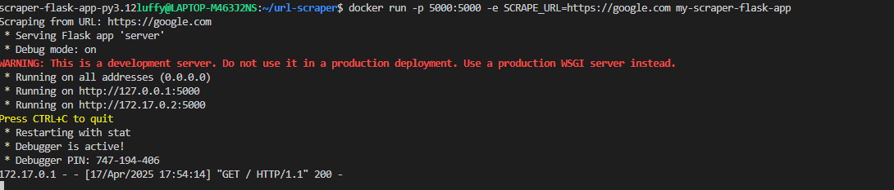

# 🗈️ URL Scraper Project — JSON Data 

This project scrapes a website URL, generates:
- `scraped_data.json` — Structured data (Title, Meta Description)
- `screenshot.png` — Screenshot of the website page

It uses:
- **Node.js + Puppeteer + Chromium** for scraping
- **Python + Flask** for hosting 
- **Poetry** for python dependencies and for creating venv
- **Docker (Multi-Stage Build)** for containerization

---

## 👢️ Project Structure

```plaintext
url-scraper/
├── apt.txt               # Linux packages needed (e.g., Chromium)
├── Dockerfile            # Multi-stage Dockerfile (Node and Python)
├── pyproject.toml        # Python dependencies (Poetry)
├── poetry.lock           # Python dependency lock
└── src/
    ├── node/
    │   ├── scrape.js              # Puppeteer script (scrapes data and takes screenshot)
    │   ├── package.json            # Node.js project file
    │   ├── package-lock.json      
    │   
    └── python/
        └── server.py               # Flask server to serve JSON data
```

---

## 🛠️ Setup Instructions

### Step 1: Build Docker Image

```bash
docker build -t my-scraper-flask-app .
```

### Step 2: Run Docker Container

Run with a custom URL (e.g., facebook.com):

```bash
docker run -p 5000:5000 -e SCRAPE_URL="https://facebook.com" my-scraper-flask-app
```
- You can set default url in scrape.js.
---

## 🌍 Accessing the Outputs

### 1. Access Scraped JSON Data

After container is running:

- Open browser and go to:
  ```
  http://localhost:5000/
  ```

  
  
- You will see the JSON response like:

```json
{
  "title": "Facebook – log in or sign up",
  "description": "Connect with friends and the world around you on Facebook."
}
```

---

## 🔥 Technologies Used

- Node.js 18 (Puppeteer)
- Python 3.10 (Flask)
- Docker (Multi-stage build)

---

## 🭹 Important Reminders

- If you change the code (`scrape.js` or `server.py`), rebuild the Docker image:
  ```bash
  docker build -t my-scraper-flask-app .
  ```
- Always pass a **proper full URL** (starting with `https://`).

---

## 📢 Final Notes

This project demonstrates full-stack scraping + hosting via a single Docker container using Node.js and Python together.

